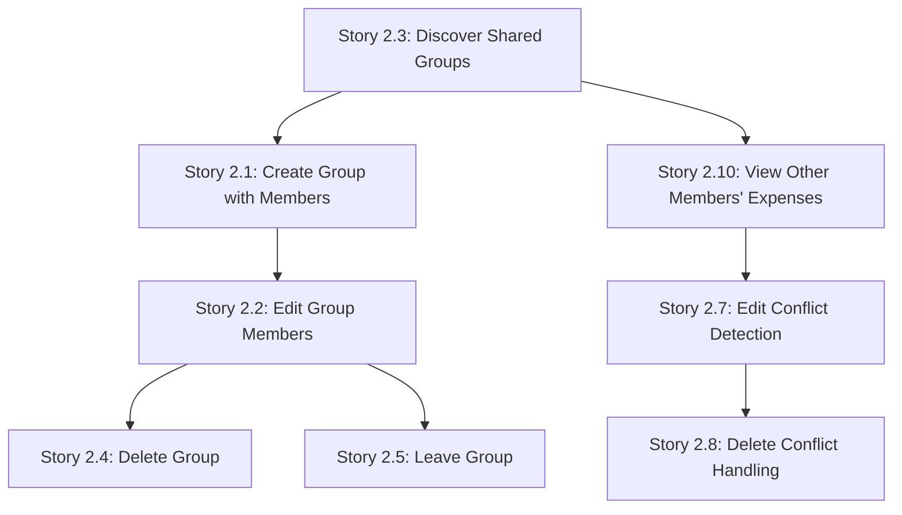

# Multi-User Support Implementation Plan

## Executive Summary

This plan details the implementation of multi-user group support for Quozen, enabling multiple Google users to collaborate on shared expense groups. The feature leverages Google Drive's sharing mechanism and implements manual sync with conflict detection.

---

## Current Architecture Analysis

### Strengths to Maintain
- ✅ Client-side only (no backend)
- ✅ Google OAuth implicit flow with scopes for Sheets and Drive
- ✅ Direct Google Sheets API usage via `GoogleDriveProvider`
- ✅ Schema already supports multiple members (`Members` tab with `userId`, `email`, `name`, `role`, `joinedAt`)
- ✅ Expense splits already support multiple users
- ✅ Refresh button already exists in Header component

### Key Files to Modify
| File | Purpose |
|------|---------|
| `src/lib/storage/google-drive-provider.ts` | Add sharing, permission management, enhanced queries |
| `src/lib/storage/types.ts` | Add interfaces for sharing, conflict metadata |
| `src/pages/groups.tsx` | Add members field, edit/delete/leave group UI |
| `src/pages/expenses.tsx` | Add conflict detection on edit/delete |
| `src/pages/dashboard.tsx` | Enhance "paid by" display, balance calculations |
| `src/pages/add-expense.tsx` | Already supports multi-member splits ✅ |
| `src/components/header.tsx` | Refresh button already exists ✅ |

---

## User Stories Breakdown

### Story 2.1: Create Group with Members (Owner)

**Scope**: Enhance group creation dialog to optionally accept member emails

**Tasks**:
1. **UI Changes** - `src/pages/groups.tsx`:
   - Add "Members" textarea field (comma-separated emails)
   - Add email validation helper (warn but don't block on invalid)
   - Update form submission to pass member list

2. **Storage Layer** - `src/lib/storage/google-drive-provider.ts`:
   - Extend `createGroupSheet()` to accept `memberEmails: string[]`
   - Add each valid member to Members tab with `role="member"`
   - Implement `shareSpreadsheet(fileId, email)` using Drive Permissions API
   - Handle partial sharing failures gracefully

3. **Interface Updates** - `src/lib/storage/types.ts`:
   - Update `IStorageProvider.createGroupSheet` signature

4. **Tests**: Add unit tests for email validation, integration test for sharing

---

### Story 2.2: Edit Group Members (Owner)

**Scope**: Allow owners to add/remove members from existing groups

**Tasks**:
1. **UI Changes** - `src/pages/groups.tsx`:
   - Add "Edit" button (visible only if user is admin)
   - Reuse create dialog with pre-filled data (name, members)
   - Show validation error if removing member with expenses

2. **Storage Layer** - `src/lib/storage/google-drive-provider.ts`:
   - Implement `updateGroupMembers(spreadsheetId, members[])`:
     - Add new member rows to Members tab
     - Delete removed member rows
     - Share with new members
     - Revoke permissions for removed members via `permissions.delete`
   - Implement `checkMemberHasExpenses(spreadsheetId, userId)`:
     - Scan Expenses tab for `paidBy` matching userId
     - Scan splits in each expense for userId

3. **Interface Updates** - `src/lib/storage/types.ts`:
   - Add `updateGroupMembers()` and `checkMemberHasExpenses()` to interface

---

### Story 2.3: Discover Shared Groups (Member)

**Scope**: Show shared groups in the groups list with role badges

**Tasks**:
1. **Storage Layer** - `src/lib/storage/google-drive-provider.ts`:
   - Modify `listGroups()` query to:
     - Filter by `name contains 'Quozen - '`
     - Include `sharedWithMe = true or 'me' in owners`
   - For each file:
     - Validate structure (Members, Expenses, Settlements tabs)
     - Check if current user exists in Members tab
     - Skip invalid/corrupted files with console warning
   - Return enhanced Group object with `isOwner: boolean`

2. **UI Changes** - `src/pages/groups.tsx`:
   - Display "Owner" or "Member" badge on each group card
   - Show "Active" badge for current group

3. **Interface Updates** - `src/lib/storage/types.ts`:
   - Add `isOwner: boolean` to Group interface

---

### Story 2.4: Delete Group (Owner Only)

**Scope**: Allow owners to delete their groups

**Tasks**:
1. **UI Changes** - `src/pages/groups.tsx`:
   - Add "Delete" button (visible only if user is owner)
   - Add confirmation dialog with warning about permanent deletion
   - Handle active group deletion (switch to another or show empty state)

2. **Storage Layer** - `src/lib/storage/google-drive-provider.ts`:
   - Implement `deleteGroup(spreadsheetId)` using Drive files.delete API

3. **Interface Updates** - `src/lib/storage/types.ts`:
   - Add `deleteGroup()` to interface

---

### Story 2.5: Leave Group (Member Only)

**Scope**: Allow non-owner members to leave a group

**Tasks**:
1. **UI Changes** - `src/pages/groups.tsx`:
   - Add "Leave Group" button (visible only if user is NOT owner)
   - Check if member has expenses before showing confirmation
   - Show confirmation dialog

2. **Storage Layer** - `src/lib/storage/google-drive-provider.ts`:
   - Implement `leaveGroup(spreadsheetId, userId)`:
     - Remove user's row from Members tab
     - (Note: Can't revoke own permission, but removal from Members is sufficient)

3. **Interface Updates** - `src/lib/storage/types.ts`:
   - Add `leaveGroup()` to interface

---

### Story 2.6: Manual Refresh Button

**Status**: ✅ **Already Implemented**

The refresh button already exists in `src/components/header.tsx`:
- Global "Refresh" button in header with rotating sync icon
- Invalidates all `["drive"]` queries on click
- Shows spinning animation during sync
- Available on all pages

---

### Story 2.7: Edit Conflict Detection

**Scope**: Detect and prevent overwrites when editing expenses/settlements

**Tasks**:
1. **Schema Changes**:
   - Ensure `meta.lastModified` is tracked (already partially in place)
   - Update expense creation to include `lastModified`

2. **Storage Layer** - `src/lib/storage/google-drive-provider.ts`:
   - Implement `getExpenseByRowIndex(spreadsheetId, rowIndex)` for conflict check
   - Implement `updateExpenseWithConflictCheck()`:
     - Fetch current state before saving
     - Compare `lastModified` timestamps
     - Throw `ConflictError` if different
     - Update `lastModified` on successful save

3. **UI Changes** - `src/pages/edit-expense.tsx`:
   - Catch `ConflictError` and show conflict dialog
   - "Refresh Data" button reloads and returns to expenses list

4. **Error Types** - Create `src/lib/errors.ts`:
   - Define `ConflictError` class

---

### Story 2.8: Delete Conflict Handling

**Scope**: Handle deleted expenses gracefully

**Tasks**:
1. **UI Changes** - `src/pages/edit-expense.tsx`:
   - Check if expense exists before showing edit form
   - If not found, show "Expense Not Found" dialog
   - Implement "Refresh & Go Back" flow

2. **Storage Layer** - `src/lib/storage/google-drive-provider.ts`:
   - Enhance `deleteExpense()` with existence check

---

### Story 2.9: Add Expense with Multiple Members

**Status**: ✅ **Already Implemented**

The add expense page already supports:
- Showing all members from Members tab in "Split Between" section
- Checkboxes for each member with avatar and name
- "Select All" / "Deselect All" functionality
- Auto-calculate equal split
- Manual amount adjustment
- Sum validation

---

### Story 2.10: View Other Members' Expenses

**Scope**: Enhance expense display to show payer and ownership context

**Tasks**:
1. **UI Changes** - `src/pages/expenses.tsx` & `src/pages/dashboard.tsx`:
   - Show "Paid by You" (green) vs "Paid by [Name]" context
   - Show "You owe $X" (red) or "You're owed $X" (green)

2. **Dashboard Enhancements** - `src/pages/dashboard.tsx`:
   - Verify balance calculation works correctly with multiple members
   - Add "Settle" button next to each member with non-zero balance

**Note**: Balance calculation logic already exists (`useMemo` in dashboard.tsx) and should work with multiple members.

---

## Implementation Order (Recommended)

The stories should be implemented in the following order to build upon each other:



**Recommended sequence**:
1. **Story 2.3** - Foundation: Discover shared groups (enables seeing shared content)
2. **Story 2.1** - Create group with members (enables sharing)
3. **Story 2.2** - Edit group members (full member management)
4. **Story 2.4** - Delete group (owner cleanup)
5. **Story 2.5** - Leave group (member cleanup)
6. **Story 2.10** - View other members' expenses (better multi-user UX)
7. **Story 2.7** - Edit conflict detection (data integrity)
8. **Story 2.8** - Delete conflict handling (data integrity)

---

## Project Tracker

| Story | Status | Notes |
|-------|--------|-------|
| 2.1 - Create Group with Members | [ ] Not Started | |
| 2.2 - Edit Group Members | [ ] Not Started | Depends on 2.1 |
| 2.3 - Discover Shared Groups | [ ] Not Started | Foundation story |
| 2.4 - Delete Group (Owner) | [ ] Not Started | |
| 2.5 - Leave Group (Member) | [ ] Not Started | |
| 2.6 - Manual Refresh Button | [x] Complete | Already implemented |
| 2.7 - Edit Conflict Detection | [ ] Not Started | |
| 2.8 - Delete Conflict Handling | [ ] Not Started | |
| 2.9 - Multi-Member Splits | [x] Complete | Already implemented |
| 2.10 - View Other Members' Expenses | [ ] Not Started | |

---

## Technical Considerations

### OAuth Scopes
Current scopes (`spreadsheets`, `drive.file`) should be sufficient for:
- Creating spreadsheets
- Reading/writing to spreadsheets user can access
- Sharing files user owns

May need to add `https://www.googleapis.com/auth/drive` for:
- Listing `sharedWithMe` files
- Revoking permissions

### Google Drive API Permissions
```typescript
// Share a file
gapi.client.drive.permissions.create({
  fileId: spreadsheetId,
  requestBody: {
    type: 'user',
    role: 'writer',
    emailAddress: email
  },
  sendNotificationEmail: true
});

// Revoke a permission
gapi.client.drive.permissions.delete({
  fileId: spreadsheetId,
  permissionId: permissionId
});
```

### Conflict Detection Strategy
- Store `lastModified` ISO timestamp in expense/settlement `meta` field
- Before update: fetch current row, compare timestamps
- If different: reject with `ConflictError`
